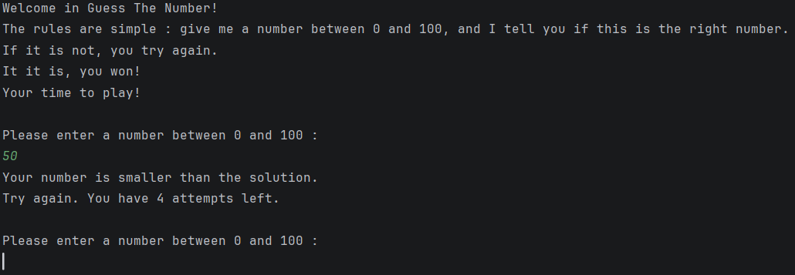
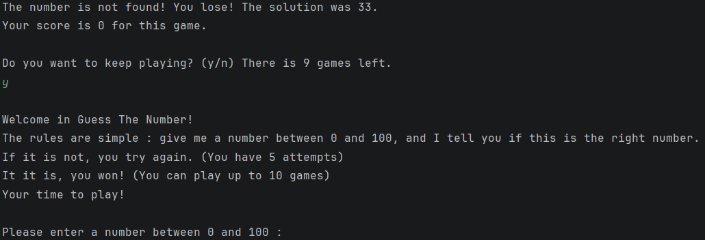
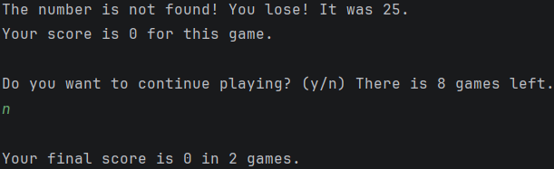

# Guess The Number

This is a **mini-game** where the user has to guess a number randomly generated by the computer.

---

## 📝 Description 

This game has been developed with **IntelliJ IDEA** and is executed in **console mode**.  

### 🎯 Game's goal

The computer randomly generated a number between 0 and 100 (called `solutionNumber`). 
The user has to guess this number within a limited attempts.

At each attempt, the program indicates if the entered number is :
- **Bigger** than the `solutionNumber`,
- **Smaller** than the `solutionNumber`,
- **Correct** (print a victory message).

### 📜 Rules
- **Number of rounds** : the user can play up to **10 rounds**. 
He chooses at each end of game if he wants to continue (`y`) or stop (`n`) playing.
- **Attempts in a round** : **5 attempts** maximum each game.
- **Score system** :
  - If the user finds at the **first attempt**, the score of this game is 10.
  - The score starts at 4 and decreases by 1 at each attempt performed.  
  *(Examples : if the user finds in 2 attempts,
  the score is 4 ; if he finds in 3 attempts, the score is 3, ...)*
  - The **final score** is the addition of the scores of all the played rounds.

### 📌 Features

| Feature               | Description                                   |
|-----------------------|-----------------------------------------------|
| **Random generation** | Number between 0 and 100.                     |
| **Inputs validation** | Verification of numbers and choices (y/n).    |
| **Limited attempts**  | 5 attempts per round.                         |
| **Multi-rounds**      | Up to 10 rounds, with the choice to continue. |
| **Score system**      | Based on the number of attempts.              |
 
---

## 🎮 Demo

- **The user starts the game and enter his first attempt :**



- **The user chooses to keep playing, so a new round starts :**



- **The user chooses to stop playing, so the final score is displayed :**



---

## 🛠 Technologies
- **Language** : Java.
- **IDE** : IntelliJ IDEA.
- **Tests** : JUnit 6.
- **Tools** : Maven, Git.

---

## 🚀 Execution

### Prerequisites

- Java 19 minimum ([Download here](https://www.oracle.com/java/technologies/downloads/#java21)). 
- A terminal or an IDE (IntelliJ, VS Code, Eclipse).

### With a terminal

- With Maven :

  1. Clone the repository : `git clone https://github.com/rachel-learns/guess-the-number.git`
  2. Execute the command : `mvn compile exec:java`  
  3. To execute the tests : `mvn test` (optional)


- Without Maven :
  1. Download the `.jar` file in the Release section.
  2. Execute the command : `java -jar GuessTheNumber-1.0-SNAPSHOT.jar`

### With an IDE

1. Clone the repository : `git clone https://github.com/rachel-learns/guess-the-number.git`
2. Open the project with your IDE.
3. Compile and execute the main class (Main.java).

---

## 📁 Project structure

### 🧩 Structure

```
GuessTheNumber/
|---assets/
|   |---userInput.png
|   |---userKeepsPlaying.png
|   |---userStopsPlaying.png
|---src/
|   |---main/
|   |   |---java/
|   |       |---org/example/
|   |           |---Main.java
|   |           |---OneGame.java
|   |---test/
|       |---java/
|           |---org/example/
|             |---OneGameTest.java
|---pom.xml
|---README.md
```
### 🔗 Links

- [Main.java](src/main/java/org/example/Main.java) : entry point.
- [OneGame.java](src/main/java/org/example/OneGame.java) : source code of the game.
- [OneGameTest.java](src/test/java/org/example/OneGameTest.java) : the test file.
- [pom.xml](pom.xml) : configuration file.
- [README.md](README.md) : the file you're currently reading, 
which contains the explanations.

---

## 🧪 Tests
The tests cover :
- The random number generation (`generateRandomNumberTest`).
- The comparison logic (`compareNumbersTest`).
- The calculation of the score (`scoreOneGameTest`).

---

## 📚 Demonstrated skills

| Skill                         | Explanation                           |
|-------------------------------|---------------------------------------|
| **Algorithm logic**           | Game conception with clear rules.     |
| **Management of user inputs** | Checking that the inputs are valid.   |
| **Java programming**          | Use of loops, conditions and methods. |
| **Unit tests**                | Code verification with JUnit.         |
| **Documentation**             | Clear explanations for all audiences. |

---
